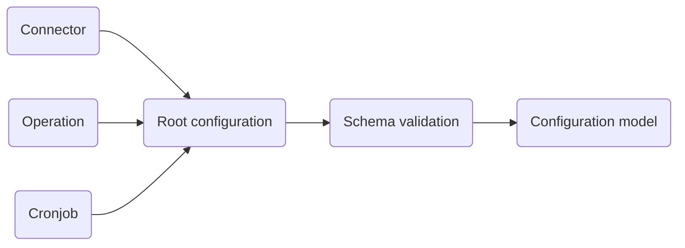
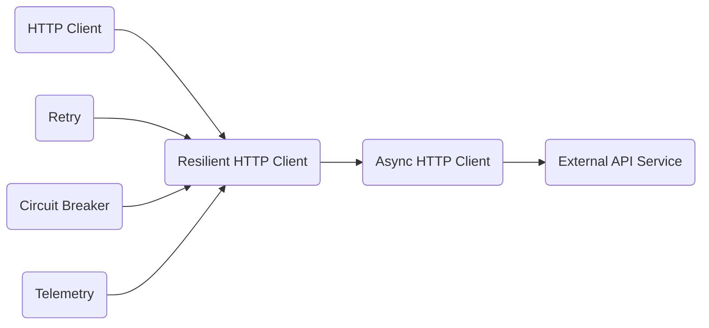

# pricelab-core

`pricelab-core` is the foundational shared library of the PriceLab ecosystem. It provides reusable infrastructure and
domain components that standardize development across microservices and internal services.

**Design principles:** Modularity · Reusability · Maintainability

---

## Table of Contents

- [Features](#features)
    - [Infrastructure Modules](#infrastructure-modules)
    - [Business Logic Modules](#business-logic-modules)
- [Installation](#installation)
- [Usage Examples](#usage-examples)
    - [Microservice Configuration](#microservice-configuration)
    - [Resilient HTTP Client](#resilient-http-client)

---

## Features

The library is organized into two domains: **Infrastructure** (reusable technical capabilities) and **Business Logic** (
domain-oriented abstractions).

### Infrastructure Modules

| Module                              | Description                                                                                                                          |
|-------------------------------------|--------------------------------------------------------------------------------------------------------------------------------------|
| **Configuration Management**        | Centralized, environment-driven config via YAML, environment variable injection, typed models, and validation                        |
| **Logging**                         | Standardized structured logging utilities                                                                                            |
| **Telemetry & Observability**       | Distributed tracing, metrics collection, OpenTelemetry integration, request lifecycle tracking, and error monitoring                 |
| **HTTP Client Utilities**           | Asynchronous HTTP clients with retry policies, circuit breaker integration, timeout management, request tracing, and fault tolerance |
| **Serialization / Deserialization** | JSON, HashMap, and binary serialization with typed model conversion, schema validation, and DTO mapping                              |
| **Scientific computation engine**   | Numerical computing and data analysis                                                                                                |
| **Profiler**                        | Performance profiling and optimization                                                                                               |
| **File handler**                    | File handling utilities                                                                                                              |
| ...                                 | ...                                                                                                                                  |

### Business Logic Modules

| Module                   | Description                                                                                   |
|--------------------------|-----------------------------------------------------------------------------------------------|
| **Core Domain Models**   | Shared business entities and value objects (e.g. Candles/Quotes, time-series, pricing models) |
| **Validation Utilities** | Schema validation, business rule enforcement, and constraint validation                       |

---

## Installation

**Stable release** (recommended for production):

```bash
pip install pricelab-core
```

**Development build** (latest features, may be unstable):

```bash
pip install -i https://test.pypi.org/simple/ pricelab-core
```
> [!WARNING]
> The development build is intended for testing only and should **not** be used in production.

---

## Usage Examples

### Microservice Configuration

Services are configured using YAML files combined with environment variables.

#### Architecture




#### Environment Variables

| Variable                   | Description                      |
|----------------------------|----------------------------------|
| `APP_ENV`                  | Application environment          |
| `CONFIGURATION_DIR`        | Root configuration directory     |
| `<CONNECTOR_NAME>_API_KEY` | API key for a specific connector |
| `DB_HOST`                  | Database host                    |
| `DB_PORT`                  | Database port                    |
| `DB_NAME`                  | Database name                    |
| `DB_USER`                  | Database username                |
| `DB_PASSWORD`              | Database password                |

#### Directory Structure

| Path         | Description                                 |
|--------------|---------------------------------------------|
| `connector/` | Data source connector definitions           |
| `operation/` | Retrieval operations and business use cases |
| `cronjob/`   | Scheduled job definitions                   |
| `root.yml`   | Root application configuration              |

**Example layout:**

```
<env>/
├── connector/
│   ├── api.yml
│   ├── database.yml
│   ├── file.yml
│   └── telemetry.yml
├── cronjob/
│   └── intraday_stock.yml
├── operation/
│   └── intraday_stock.yml
└── root.yml
```

#### YAML Configuration Reference

**Connector** (`connector/<tag>.yml`)

```yaml
connector:
  <connector_tag>:
    name: <connector name>
    type: api
    base_url: <base url>
    timeout: 5
    retry: 3
    auth:
      type: token
      key_name: apikey
      key_value: ${oc.env:connector_api_key}
```

**Operation** (`operation/<tag>.yml`)

```yaml
operation:
  <operation_tag>:
    name: <operation name>
    connector: ${connector.connector_tag}
    endpoint: <endpoint>
    method: GET
    parameters:
      <parameter1>: <value1>
      <parameter2>: <value2>
```

**Cronjob** (`cronjob/<tag>.yml`)

```yaml
cronjob:
  <cronjob_tag>:
    name: <cronjob name>
    operation: ${operation.operation_tag}
    cron: "*/5 9-17 * * 1-5"
```

---

### Resilient HTTP Client

This example builds a fault-tolerant async HTTP client with retry logic, circuit breaking, and observability.

#### Architecture



#### Complete Example

```python
# Base async HTTP client via AioHttpClient
base_client: HttpClient = AioHttpClient(base_url="<base url>")

# Retry policy
retry_policy: Retry = RetryPolicy(
    RetrySettings(max_attempts=3, delay_seconds=1)
)

# Circuit breaker
circuit_breaker: CircuitBreaker = CircuitBreakerPolicy(
    CircuitBreakerSettings(failure_threshold=2, recovery_timeout=30)
)

# Telemetry via OpenTelemetry
telemetry: Telemetry = OpenTelemetryManager(service_name="<external api name>")

# Compose the resilient client
client: ResilientHttpClient = ResilientClient(
    base_client=base_client,
    circuit_breaker=circuit_breaker,
    retry_policy=retry_policy,
    trace_manager=telemetry,
)


async def fetch_intraday_stock() -> None:
    try:
        await client.start()

        params = {
            "function": "<function name>",
            "symbol": "<stock symbol>",
            "interval": "<time interval>",
            "apikey": "<api key>",
        }

        response = await client.get("/<endpoint>", params=params)
        print(response)

    finally:
        # Always clean up resources
        await client.close()
        telemetry.shutdown()
```